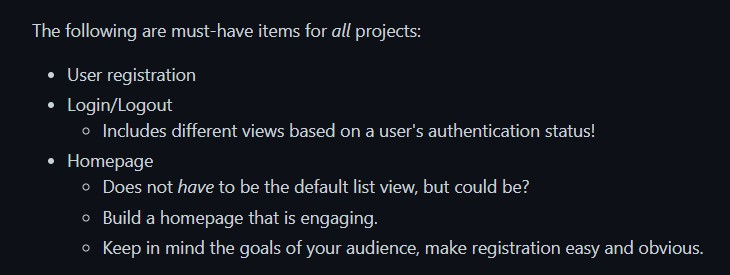
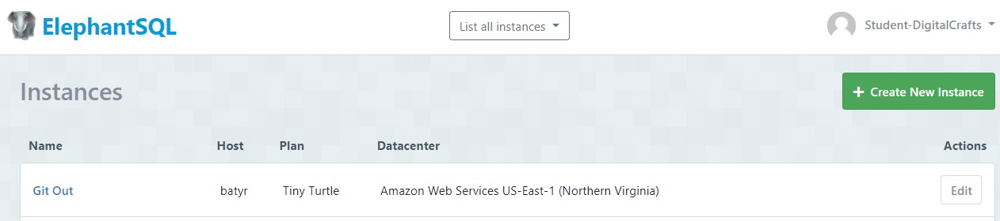

# Back_End_Project

Welcome to the README for my DigitalCrafts Back-End Project: Git2Traveling. This repo has been forked from the official project to allow for continued refactoring without altering the rest of the team's files. In this README I would like to walkthrough the project and highlight my specific contributions.

Git2Traveling was built with (I highly recommend visiting their portfolios to see some of their work as well):

David Vasek - https://github.com/david-vasek
Daniel Agbenu - https://github.com/Dannyagg

Project Overview - 

  Specifically, we were using the MVC (Model, View, Controller) framework to build a Travel Itinerary Planner utilizing Node.js and a PostrGres database.

