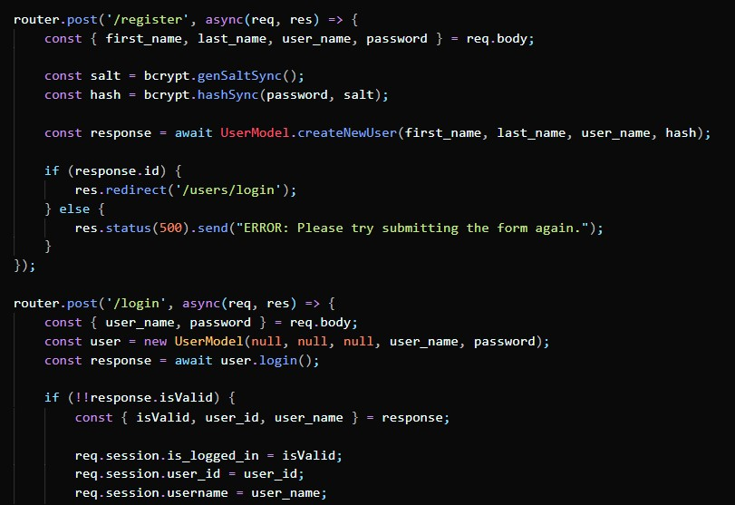

# Back_End_Project

Welcome to the README for my DigitalCrafts Back-End Project: Git2Traveling. This repo has been forked from the official project to allow for continued refactoring without altering the rest of the team's files. In this README I would like to walkthrough the project and highlight my specific contributions.

Git2Traveling was built with (I highly recommend visiting their portfolios to see some of their work as well):

David Vasek - https://github.com/david-vasek
 Daniel Agbenu - https://github.com/Dannyagg

Project Overview - 

  Specifically, we were using the MVC (Model, View, Controller) framework to build a Travel Itinerary Planner utilizing Node.js and a PostGres database.

 Daniel took the lead on the initial build of SQL data for the schema and the seed. David made an early start on the navigation and template build for the views. So I began with a user-login feature. We used bcrypt.js in node.js to handle the password encryption. 

 After the first models were complete I moved onto POST routes for register and login functions.

 Here's a look at the final product with some bootstrap CSS.

 So now we focused on the main functionality. Using a SQL table to track the trips and a separate SQL table to track the specific itinerary for that trip (thank you, Daniel) I began building models and routes to access and record the data. We built a page to display a User's Trip History (only viewable after the user logs in), which would then redirect to the itinerary for that trip.

 I had the opportunity to write some original functionality in the form of Javascript to compute the number of days in a given trip (taking the dates supplied by a user) in order to break out a daily itinerary.

 Our deadline came up sooner than expected and but we are continually fine-tuning the application. Although the site isn't live at this time, we all hope to be able to get it up and running soon. Please feel free to reach out with any comments or see my other projects @ https://github.com/naldridge.
